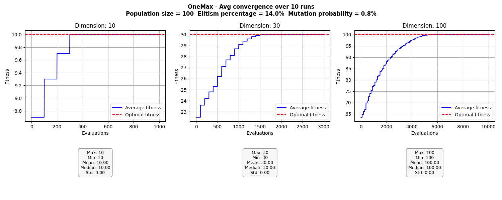
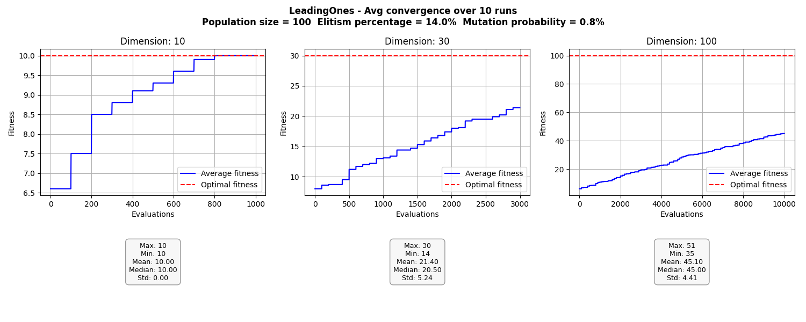

# Genetický algoritmus
Pro oba algoritmy byl použit rank selection pro výběr rodičů.

## One-Max problem
U One-Max nastavované parametry neměly příliš velký vliv a algoritmus dosahoval téměř vždy optimálního řešení a to i v D=100.

## Leading Ones problem
U Leading Ones už parametry měly značný vliv na výsledky. Nejlepších hodnot dosahoval algoritmus s velikostí populace 100, 14% podílu Elit a pravděpodobností mutace 0,8%.

Malý vliv parametrů u One-Max je pravděpodobně způsoben tím, že nezáleží na pořadí bitů, mají stejnou váhu a případná mutace příliš neovlivní výsledek.

U Leading Ones už záleží na pořadí bitů a mutace bitů s vyšší váhou na výrazně ovlivňuje výsledek.
